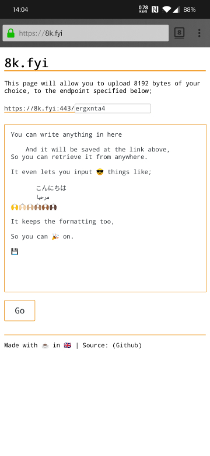
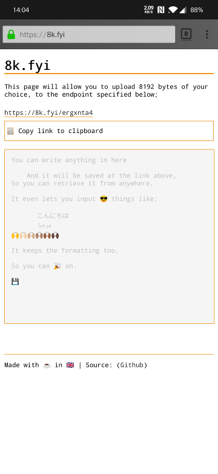
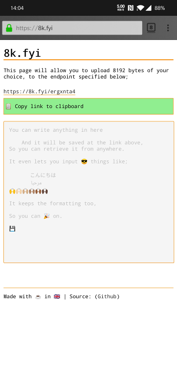

# 8k.fyi

  

Text storage / link maker with a default byte max of 8192 (configurable).

The input box retains whitespace, and supports Unicode entry (such as Emoji).

This early version stores data in memory only and uses a hash of the path as the storage key so that path is not stored on the server (the data itself is however stored in plaintext). The link it generated uses z-Base32 (https://en.wikipedia.org/wiki/Base32#z-base-32) to make the links easier to memorise.

Currently the server requires no external dependencies, however, it may become necessary, given some of the features I would like to add, to use some external libraries (e.g. for client side encryption in the browser, or for alternative storage backends)

# Demo

https://8k.fyi

# Command line usage

## CURL
The key to using CURL is to be sure to send the data using `--data-binary` to ensure it arrives intact.

Pass the filename to be uploaded to the `--data-binary` flag using `@<filename>`,
> On the command line, you need to specify an endpoint to use, so just make one up thats easy to remember.

```
curl -X POST --data-binary @nginx.log https://8k.fyi/nlog
https://8k.fyi/nlog
```
or alternatively if you want to cat or send the output of another command,
pipe the data to curl, and tell curl to read from stdin using `--data-binary @-`
```
cat datasheet.pdf | curl -X POST --data-binary @- https://8k.fyi/d.pdf
https://8k.fyi/d.pdf
```
A successful upload will return a 200 OK and the URL to the data you uploaded

## HTTPie

```
http https://8k.fyi/tf < file.txt
```
you can retrieve the file just as simply;
```
http https://8k.fyi/tf > file.txt
```

# Building

This project currently requires no external dependencies. There are no modules to pull, just build the code and run it.

## Docker
```
docker build -t 8192bytes --build-arg VERSION='1.0.0-alpha1' .
```

## Buildah
```
buildah bud -f Dockerfile --build-arg VERSION='1.0.0-alpha1' -t 8192bytes .
```

## Binary
```
CGO_ENABLED=0 go build -o 8192 -ldflags "-X github.com/2bytes/8k/internal/flags.Version=1.0.0-alpha1" cmd/8192/main.go
```

# Running

The container version can be run using Docker/Podman, and the binary can be executed on the platform for which it was built.

There are various flags for configuring the server, only `--iu-addr` is required.

```
Usage of ./8192:
  -accent-colour string
            set the accent colour for the web page (default "#FF8C00")
  -addr string
            set the bind address
  -html string
            set the path to the index html template file for the frontend (default "/frontend/index.html")
  -https
            enable TLS
  -mb int
            override the max bytes count (default 8192)
  -mi int
            set the maximum number of items to store before disallowing (default 1000)
  -pl int
            override autogenerated path length (default 8)
  -port int
            set the bind port (default 8192)
  -title string
            set the title of the web page (default "8k.fyi")
  -tls-cert string
            path to the TLS certificate (default "/tls/public.crt")
  -tls-key string
            path to the TLS key (default "/tls/private.key")
  -ttl duration
            the time before an uploaded data item expires and is deleted (default 1h0m0s)
  -ui-addr string
            UI: set the public address displayed in the UI text/links
  -ui-https
        UI: use 'https' as the proto displayed in the UI text/links
  -ui-port int
        UI: set the public port displayed in the UI/text/links (default 8192)
  -v	show version

```

## TLS

### Built-in Server
You can run the server with TLS directly by supplying the `-https` flag and mounting the certificates to `/tls/` using the
names shows in the defaults above, or, by settings the paths manually using the `-tls-cert` and `-tls-key` flags.

### Reverse Proxy
If you wish to run the server behind a reverse proxy, don't enable binding tls with `-https` but configure the `-ui-*` flags according to your requirements.

```
docker run --net backend --name 8kserver -d --rm  8192bytes --ui-addr 192.168.1.100 --ui-port 4433 --ui-https
```
If you run NGINX in Docker as a reverse proxy, you can attach nginx to the same network and refer to this server as '8kserver' in the upstream directive.

For a reverse proxy that isn't in Docker, bind the server to 127.0.0.1 and upstream nginx to that.

> Don't forget to configure your firewall (for both IPv4 and IPv6)!

Enjoy

[https://2byt.es](https://2byt.es)
